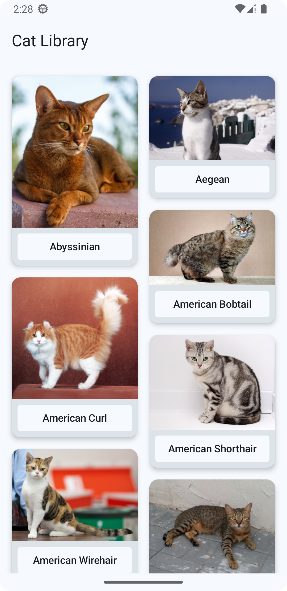
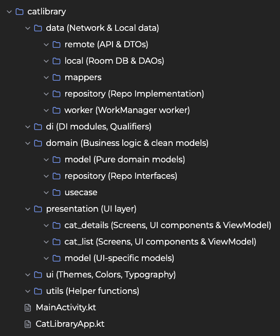

# Cat Library

Cat Library is an Android application that allows users to browse and download images of various cat breeds. The app is built using modern Android development practices and libraries.

<p align="center">
  
  
</p>

## Setup

1. **Clone the repository:**

    ```
    git clone https://github.com/ralphevmanzano/catlibrary.git
    cd catlibrary
    ```

2. **Create a `secrets.properties` file:**

    In the root directory of the project, create a file named `secrets.properties` and add your API key received via email:

    ```properties
    CAT_API_KEY=your_api_key_here
    ```

3. **Open the project in Android Studio:**

    Open Android Studio and select `Open an existing project`. Navigate to the cloned repository and open it.

4. **Build the project:**

    Sync the project with Gradle files and build the project to ensure all dependencies are downloaded.

## Architecture
The project follows **Clean Architecture** principles and implements **MVVM (Model-View-ViewModel)** to ensure a well-structured, maintainable, and testable codebase. It also employs the **Repository Pattern** and **Use Cases** to manage data and business logic efficiently.  

1. **Data Layer** → Retrieves data from **local (database) or remote (API) sources**. The **Repository** abstracts these sources and provides a single source of truth.  
2. **Domain Layer** → Contains **Use Cases**, which encapsulate business logic and process data before passing it forward.  
3. **Presentation Layer (MVVM)** → **ViewModels** interact with **Use Cases**, exposing data to the UI via **StateFlow/SharedFlow**.  

This structured approach enhances scalability, testability, and maintainability, reducing dependencies between layers. 🚀

## Project Structure


## Tech-Stack

- **Kotlin:** The primary programming language used for the development of the app.
- **Jetpack Compose:** A modern toolkit for building native Android UI.
- **Koin:** A smart Kotlin Dependency injection library.
- **Room** For caching.
- **Coroutines:** For managing background threads and performing asynchronous operations.
- **Flow:** For handling streams of data asynchronously.
- **WorkManager:** For downloading the images in the background.
- **Retrofit:** For making network requests.
- **MockK:** For mocking dependencies in unit tests.
- **JUnit:** For writing and running unit tests.
